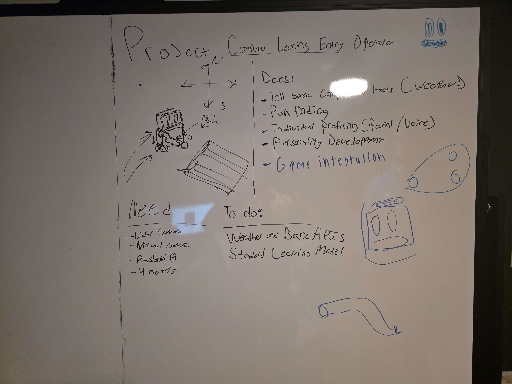
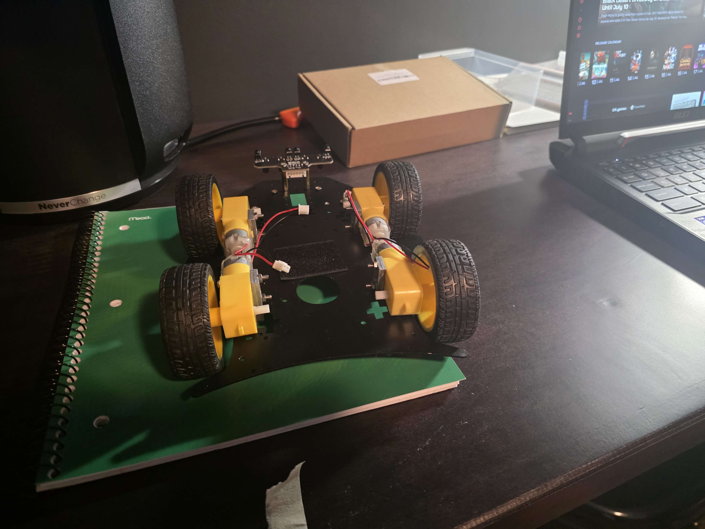

# CLEO - Computer Learning Entry Operator

CLEO (Computer Learning Entry Operator) is a conceptual robotic assistant designed for intelligent automation in environments like warehouses, smart buildings, and logistics centers. Powered by a Raspberry Pi and built using C++, CLEO integrates computer vision, LiDAR mapping, and generative AI to interact with the physical world and users in meaningful ways.

## Core Features and Technologies
Hardware Integration

Raspberry Pi: Lightweight, modular computing platform.

LiDAR Sensor: Enables 3D mapping and object detection for spatial awareness.

Camera Module: Supports facial recognition and environmental scanning.

Actuators and Motors: Allow CLEO to pick up pallets and move autonomously.

Autonomous Navigation and Pallet Handling
CLEO is designed to scan its environment using LiDAR, determine optimal paths, and autonomously navigate to and pick up pallets from the ground with precision. This involves pathfinding, obstacle avoidance, and manipulation logic.

Facial Recognition and User Interaction
Using computer vision models, CLEO can identify users by face, greet them by name, and provide personalized interaction based on identity and context.

API Access and Generative Intelligence
CLEO can connect to external APIs (e.g., for logistics, environmental data, or system status) and deliver up-to-date information. A built-in generative AI model helps formulate, rephrase, and synthesize new insights based on real-time data, providing adaptive and informative responses.

## Project Goals
CLEO aims to be a smart robotic platform that combines:

Autonomous object handling and movement

Human recognition and interaction

Real-time information access

AI-driven generative capabilities

## Vision
CLEO is not just a robot—it’s an evolving digital-physical assistant. By blending robotics, AI, and cloud data access, CLEO is envisioned as a modular, scalable solution for intelligent automation and user engagement in real-world environments.

